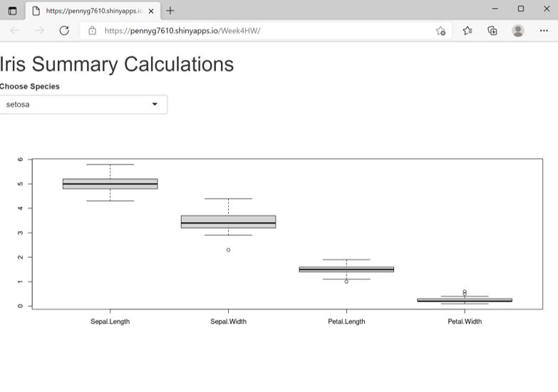

Developing Data Products - Week 4 assignment
========================================================
author: 
date: 1 DEC 2021
autosize: true

<style>
.small-code pre code {
  font-size: 1em;
}
</style>


Assignment -Part 1
========================================================

This peer assessed assignment has two parts. First, you will create a Shiny application and deploy it on Rstudio's servers. Second, you will use Slidify or Rstudio Presenter to prepare a reproducible pitch presentation about your application

### Shiny Application

Write a shiny application with associated supporting documentation. The documentation should be thought of as whatever a user will need to get started using your application.

-Deploy the application on Rstudio's shiny server
-Share the application link by pasting it into the provided text box
-Share your server.R and ui.R code on github

Assignment -Part 2
========================================================

### Reproducible Pitch Presentation

OK, you've made your shiny app, now it's time to make your pitch. You get 5 slides (inclusive of the title slide)  to pitch a your app. You're going to create a web page using Slidify or Rstudio Presenter with an html5 slide deck.

Here's what you need

-5 slides to pitch our idea done in Slidify or Rstudio Presenter
-Your presentation pushed to github or Rpubs
-A link to your github or Rpubs presentation pasted into the provided text box

Shiny App
========================================================

<font size="4"> 
Web application can be found here
<https://pennyg7610.shinyapps.io/Week4HW/?_ga=2.59745197.1620275338.1638383547-321908426.1638383547>
</font> 



Function used in server.R
========================================================
class: small-code


```r
function(input, output, session) {
      iris.dataset= iris
       iris.dataset$setosa <- iris.dataset$Species=="setosa"
       iris.dataset$virginica <- iris.dataset$Species == "virginica"
       iris.dataset$versicolor <- iris.dataset$Species == "versicolor"
       iris.dataset
#filter data then plot  
data <- reactive({
  req(input$species_list)
 df<-iris.dataset%>% select( Sepal.Length, Sepal.Width, Petal.Length, Petal.Width)%>% filter(iris.dataset$Species %in% input$species_list)
  
})
```
